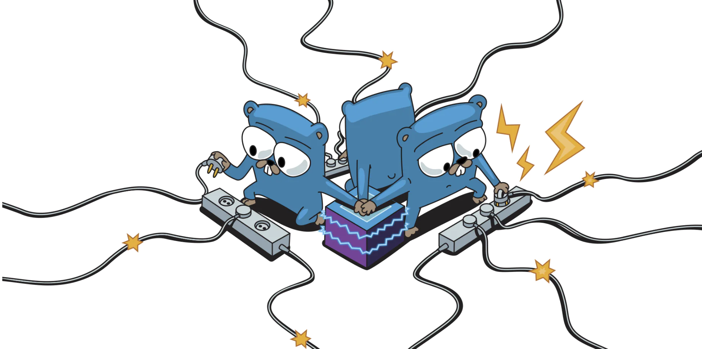

## Hi there 

    

<h1 align="center">Hi , I'm Nguyễn Công Minh</h1>
<h3 align="center">I majored in Information Technology.</h3>
<h3 align="center"><strong>&hearts;Learning to share, sharing to learn&hearts;</strong></h3>

 

    

## My Github Stats 📊

 

## Contributing

Pull requests are welcome. For major changes, please open an issue first to discuss what you would like to change.

Please make sure to update tests as appropriate.

## License

[MIT](https://choosealicense.com/licenses/mit/)
